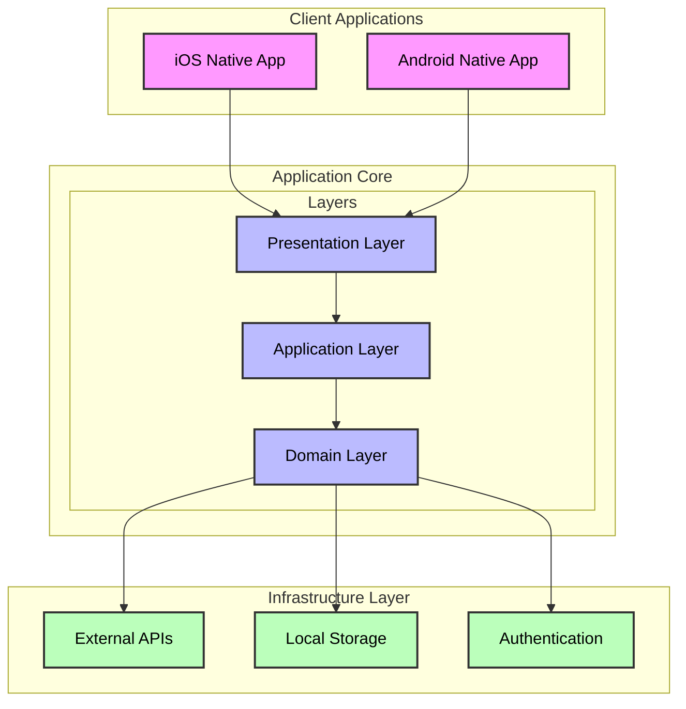
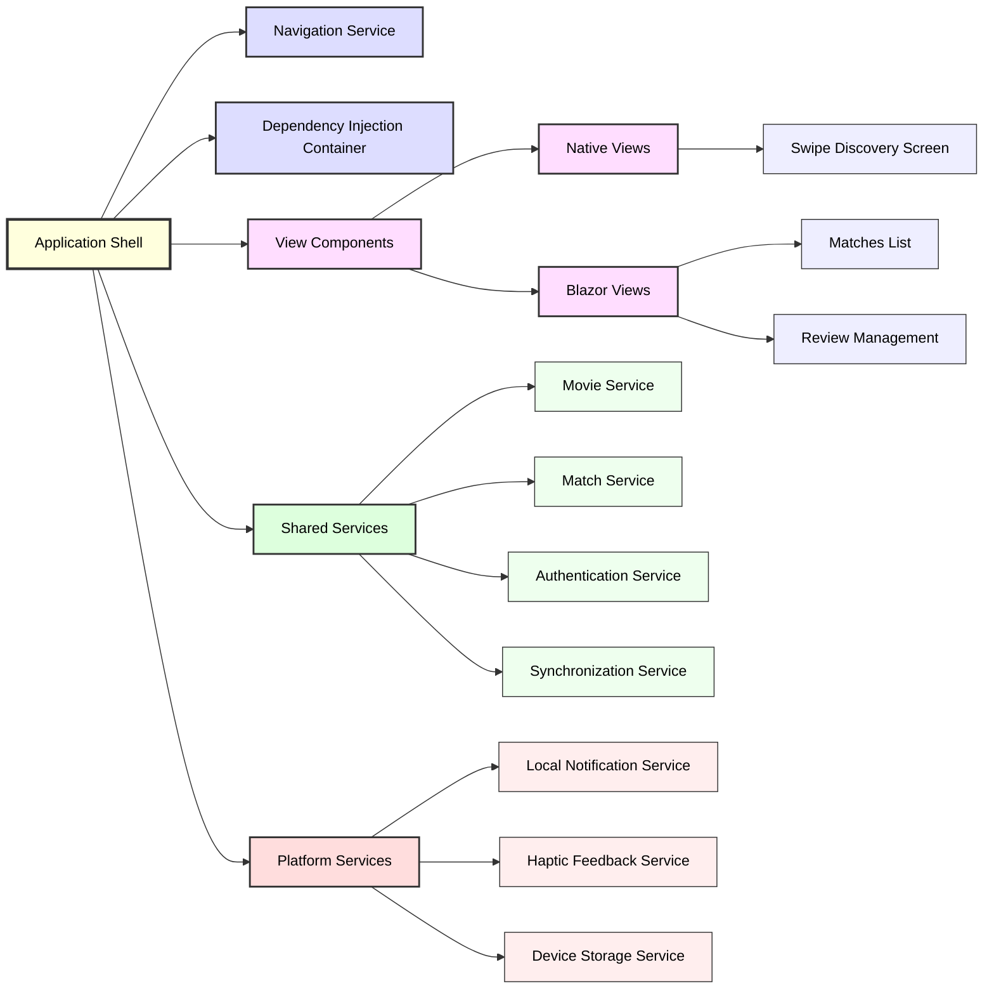
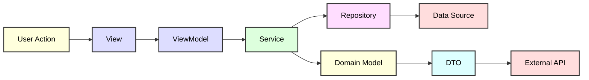

# Tinder for Movies - Technical Architecture Document

## 1. Executive Summary

This document outlines the technical architecture for a cross-platform mobile application that enables users to discover movies through a swipe-based interface. The application will be built using .NET 9 with MAUI for cross-platform capabilities and Blazor Hybrid for specific UI components.

## 2. Architecture Overview

### 2.1 Architecture Pattern
- **Primary Pattern**: Clean Architecture (Onion Architecture)
- **Presentation Pattern**: MVVM for native views, MVU for Blazor components
- **Communication Pattern**: Mediator pattern for decoupled component communication

### 2.2 High-Level System Architecture

## 3. Technology Stack

### 3.1 Core Technologies
- **Framework**: .NET 9.0
- **Mobile Platform**: .NET MAUI
- **UI Framework**: 
  - Native MAUI XAML for performance-critical views (swipe interface)
  - Blazor Hybrid for data-rich views (matches, reviews)
- **Language**: C# 13

### 3.2 Data Storage
- **Local Database**: SQLite with Entity Framework Core
- **Cache**: In-memory caching with IMemoryCache
- **User Preferences**: Platform-specific secure storage

### 3.3 External Services
- **Movie Data**: TMDb API (primary), OMDb API (fallback)
- **Authentication**: Microsoft Identity Platform
- **Analytics**: Application Insights
- **Crash Reporting**: AppCenter

### 3.4 Development & Deployment
- **Source Control**: Git
- **CI/CD**: Azure DevOps / GitHub Actions
- **Package Management**: NuGet
- **App Distribution**: App Store Connect (iOS), Google Play Console (Android)

## 4. Application Architecture

### 4.1 Layer Responsibilities

#### Presentation Layer
- Native MAUI views for swipe interaction
- Blazor components for list views and forms
- ViewModels for state management
- Platform-specific implementations

#### Application Layer
- Business logic orchestration
- Use case implementations
- Data transformation between layers
- Cross-cutting concerns (logging, validation)

#### Domain Layer
- Core business entities
- Business rules and validations
- Domain services
- Repository interfaces

#### Infrastructure Layer
- External API implementations
- Database access
- Authentication services
- Platform-specific services

### 4.2 Component Architecture

## 5. Data Architecture

### 5.1 Data Flow

### 5.2 Data Storage Strategy

#### Local Storage
- User preferences and settings
- Cached movie data
- Match history
- User reviews and ratings
- Swipe history for preventing duplicates

#### Remote Storage
- User authentication tokens
- Synchronized match data (future feature)
- Analytics and telemetry

### 5.3 Caching Strategy
- **L1 Cache**: In-memory cache for active session
- **L2 Cache**: SQLite for persistent cache
- **Cache Invalidation**: Time-based and event-based
- **Preloading**: Next 5 movies preloaded during swipe

## 6. Security Architecture

### 6.1 Authentication & Authorization
- OAuth 2.0 / OpenID Connect flow
- Secure token storage using platform keychain
- Biometric authentication support
- Session management with refresh tokens

### 6.2 Data Security
- API communication over HTTPS only
- Certificate pinning for API endpoints
- Local database encryption
- Secure storage for sensitive user data

### 6.3 Application Security
- Code obfuscation for release builds
- Anti-tampering mechanisms
- Secure API key storage
- Input validation and sanitization

## 7. Performance Architecture

### 7.1 Performance Targets
- App launch: < 3 seconds
- Swipe response: < 100ms
- Image loading: < 2 seconds
- Navigation transitions: 60 FPS

### 7.2 Optimization Strategies
- Lazy loading for non-critical components
- Image caching and compression
- Database query optimization
- Async/await throughout
- Resource pooling for expensive objects

### 7.3 Scalability Considerations
- Stateless service design
- Horizontal scaling capability
- Efficient data pagination
- Background task management

## 8. Integration Architecture

### 8.1 External API Integration
- RESTful API consumption
- Retry policies with exponential backoff
- Circuit breaker pattern for fault tolerance
- API response caching
- Rate limiting compliance

### 8.2 Platform Integration
- Deep linking support
- Share sheet integration
- Platform-specific UI adaptations
- Native gesture recognizers

## 9. Development Architecture

### 9.1 Project Structure
- Clean Architecture folder organization
- Feature-based module separation
- Shared code maximization
- Platform-specific code isolation

### 9.2 Build Configuration
- Multi-targeting for iOS and Android
- Environment-specific configurations
- Automated versioning
- Build optimization settings

### 9.3 Testing Strategy
- Unit tests for business logic
- Integration tests for services
- UI automation tests
- Performance testing
- Manual testing protocols

## 10. Deployment Architecture

### 10.1 Release Pipeline
- Automated build triggers
- Code signing automation
- Beta distribution via TestFlight/Play Console
- Production deployment gates
- Rollback procedures

### 10.2 Environment Strategy
- Development environment
- Staging environment
- Production environment
- Feature flags for gradual rollout

## 11. Monitoring & Observability

### 11.1 Application Monitoring
- Crash reporting and analytics
- Performance metrics collection
- User behavior tracking
- API call monitoring
- Error logging and alerting

### 11.2 Business Metrics
- User engagement metrics
- Feature usage analytics
- Swipe patterns analysis
- Match-to-review conversion rates

## 12. Maintenance & Evolution

### 12.1 Update Strategy
- Over-the-air updates for content
- App store updates for features
- Backward compatibility maintenance
- Data migration strategies

### 12.2 Technical Debt Management
- Regular dependency updates
- Code refactoring cycles
- Performance optimization iterations
- Security patch management

## 13. Risk Mitigation

### 13.1 Technical Risks
- API rate limiting: Implement caching and request queuing
- Platform updates: Maintain compatibility matrix
- Data loss: Regular backups and data validation
- Performance degradation: Continuous monitoring

### 13.2 Operational Risks
- Service outages: Offline mode capabilities
- Data corruption: Validation and recovery procedures
- Security breaches: Regular security audits
- Scaling issues: Load testing and capacity planning

## 14. Future Architecture Considerations

### 14.1 Potential Enhancements
- Microservices migration path
- Real-time features using SignalR
- Machine learning integration
- Cross-platform web support

### 14.2 Extensibility Points
- Plugin architecture for new features
- API versioning strategy
- Modular component design
- Feature toggle framework

---

*Document Version: 1.0*  
*Target Framework: .NET 9.0*  
*Architecture Type: Hybrid Mobile Application*  
*Last Updated: [Current Date]*